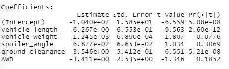
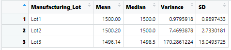
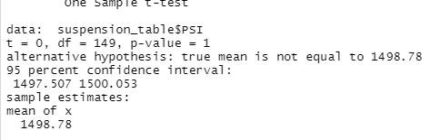
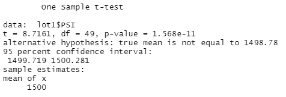
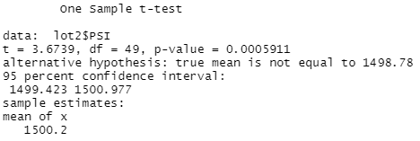
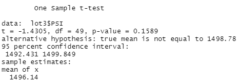

# MechaCar Statistical Analysis

## Overview/Purpose

## Results

### Linear Regression to Predict MPG

Which variables/coefficients provided a non-random amount of variance to the mpg values in the dataset?
* The variables that had the most impact would be ground clearance and vehicle length.

Is the slope of the linear model considered to be zero? Why or why not?
* No, the slope of the linear model is not zero. The reason this distinction can be made is because of the extremely small p-value(5.35e-ll.)

Does this linear model predict mpg of MechaCar prototypes effectively? Why or why not?
* Yes, the model is able to effectively predict the mpg of MechaCar prototypes. 

### Summary Statistics on Suspension Coils

Total Summary

Lot Summary

The design specifications for the MechaCar suspension coils dictate that the variance of the suspension coils must not exceed 100 pounds per square inch. Does the current manufacturing data meet this design specification for all manufacturing lots in total and each lot individually? Why or why not?
* If the aggregate variation value was used, the variation would be within the limits of this metric. When looking at the variation by lots, lot 1 and 2 fit the metric, but lot 3 fails to meet this metric since it has too high of a variance(170.2861224.)

### T-Tests on Suspension Coils

All lots t-test

lot 1 t-test

lot 2 t-test

lot 3 t-test

### Study Design: MechaCar vs Competition

Write a short description of a statistical study that can quantify how the MechaCar performs against the competition. In your study design, think critically about what metrics would be of interest to a consumer: for a few examples, cost, city or highway fuel efficiency, horse power, maintenance cost, or safety rating.

What metric or metrics are you going to test?
* k
What is the null hypothesis or alternative hypothesis?
* k
What statistical test would you use to test the hypothesis? And why?
* k
What data is needed to run the statistical test?
* k
